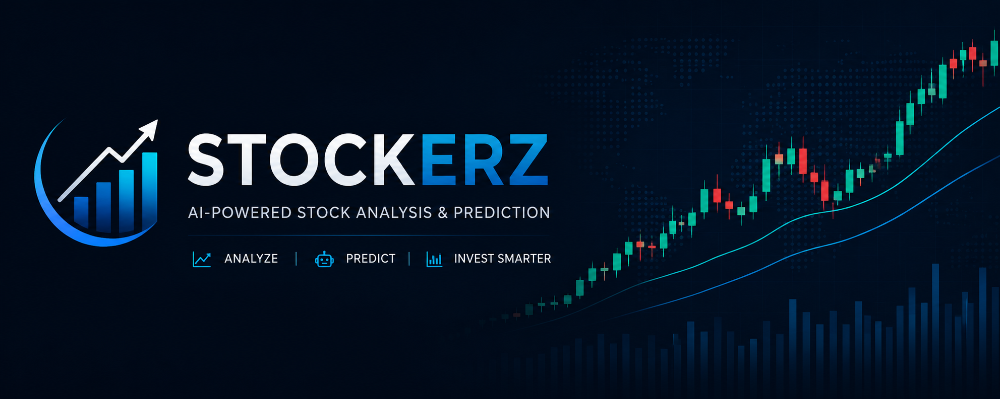
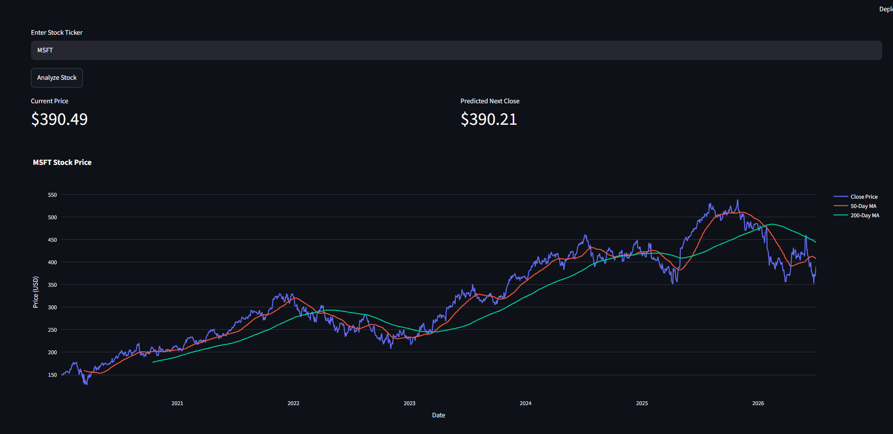
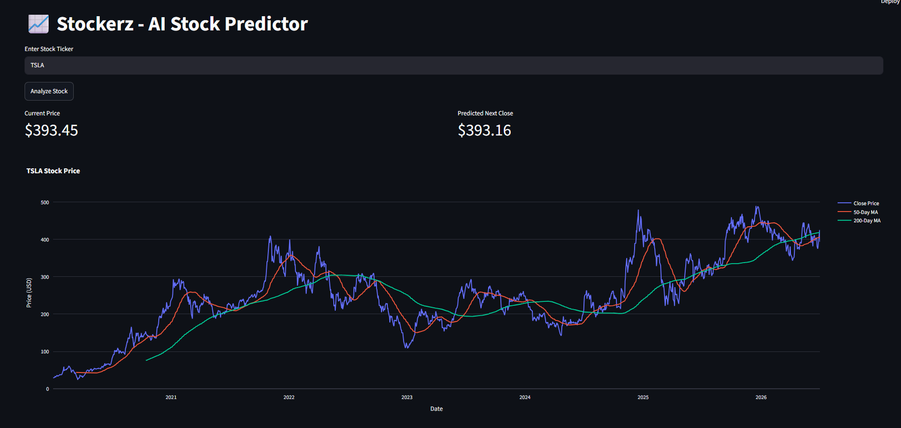

<p align="center">
  
</p>

<h1 align="center">📈 Stockerz</h1>

<h3 align="center">
AI-Powered Stock Analysis & Prediction Dashboard
</h3>

<p align="center">
Analyze historical stock prices, visualize market trends, and predict the next day's closing price using Machine Learning.
</p>

<p align="center">


</p>

---

# 🚀 Overview

**Stockerz** is an end-to-end Machine Learning project that enables users to:

* 📈 Download real-time historical stock data
* 📊 Visualize stock price trends
* 📉 Analyze 50-Day & 200-Day Moving Averages
* 🤖 Predict the next day's closing stock price
* 🌐 Interact through a modern Streamlit dashboard

The application combines data collection, preprocessing, machine learning, and interactive visualization into a single user-friendly dashboard.

---

# ✨ Features

* 📥 Download stock data using Yahoo Finance
* 📊 Interactive Plotly charts
* 📈 50-Day Moving Average
* 📉 200-Day Moving Average
* 🤖 Machine Learning prediction
* 💾 Saved ML model using Joblib
* 🌐 Streamlit Web Dashboard
* 🔍 Support for multiple stock tickers

---

# 🛠 Tech Stack

### Programming Language

<p>

</p>

### Machine Learning

* Scikit-learn
* Pandas
* NumPy

### Data Source

* Yahoo Finance API (yfinance)

### Data Visualization

* Plotly
* Matplotlib

### Web Framework

* Streamlit

### Tools

<p>

</p>

---

# 📂 Project Structure

```text
stockerz/
│
├── app.py                 # Streamlit Dashboard
├── data.py                # Download Stock Data
├── train.py               # Train Machine Learning Model
├── predict.py             # Predict Next-Day Price
├── visualize.py           # Stock Charts
├── requirements.txt
├── README.md
│
├── data/
│   └── apple_stock.csv
│
├── models/
│   └── stock_model.pkl
│
└── venv/
```

---

# ⚙️ Installation

Clone the repository

```bash
git clone https://github.com/piyushdolas8/stockerz.git
```

Move into the project

```bash
cd stockerz
```

Install dependencies

```bash
pip install -r requirements.txt
```

Run the application

```bash
streamlit run app.py
```

---

# 📊 How It Works

1. Download historical stock market data.
2. Clean and preprocess the dataset.
3. Calculate technical indicators.
4. Train a Linear Regression model.
5. Predict the next day's closing price.
6. Display predictions and charts through Streamlit.

---

# 📸 Application Preview

<p align="center">

### 🖥️ Dashboard



<br><br>

### 📈 Prediction & Interactive Chart



</p>

---

# 🔮 Future Improvements

* Random Forest Regressor
* LSTM Deep Learning Model
* GRU & Transformer Models
* Technical Indicators (RSI, MACD, Bollinger Bands)
* Real-Time Stock Prices
* News Sentiment Analysis
* Portfolio Tracker
* Multi-Stock Comparison

---

# 📖 What I Learned

Through this project I gained hands-on experience with:

* Machine Learning workflow
* Data preprocessing
* Feature engineering
* Financial data analysis
* Interactive data visualization
* Model serialization
* Streamlit application development
* Git & GitHub project management

---

# 🤝 Connect With Me

<p align="left">
  <a href="https://www.linkedin.com/in/piyush-dolas-0567a6303" target="_blank">
    
  </a>
  &nbsp;
  <a href="mailto:piyushdolas8@gmail.com">
    
  </a>
  &nbsp;
  <a href="https://www.youtube.com/@piyushbuilds2026" target="_blank">
    
  </a>
</p>

<p align="center">

⭐ If you found this project interesting, consider giving it a star!

</p>

🚀 **Live Demo:** https://stockerz-ai.streamlit.app
